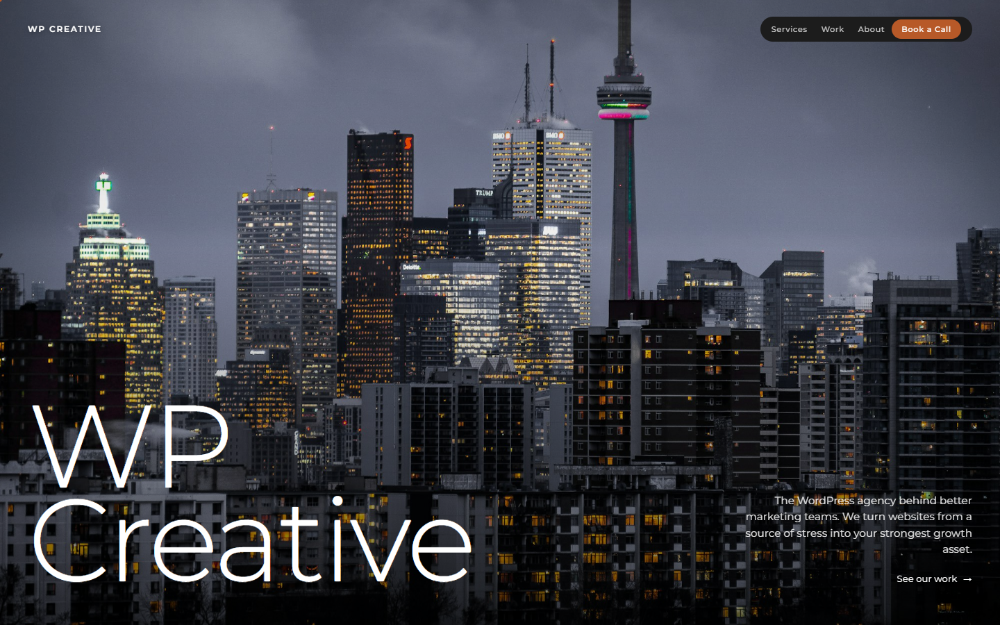
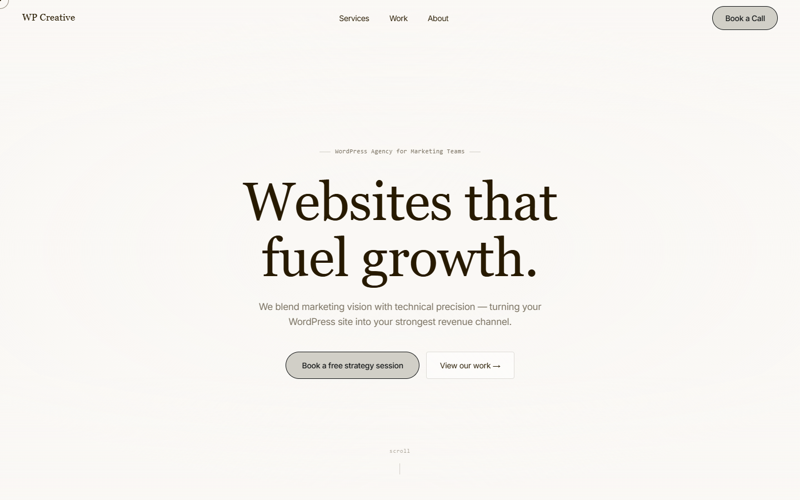
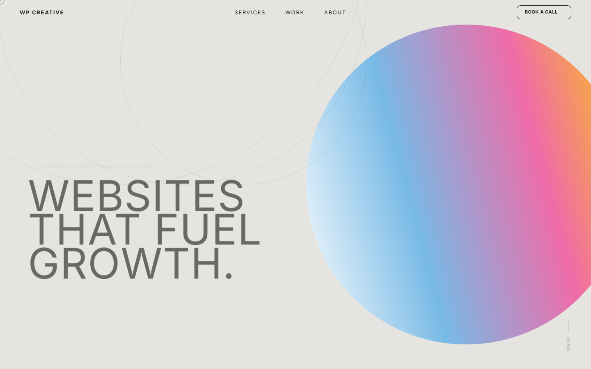
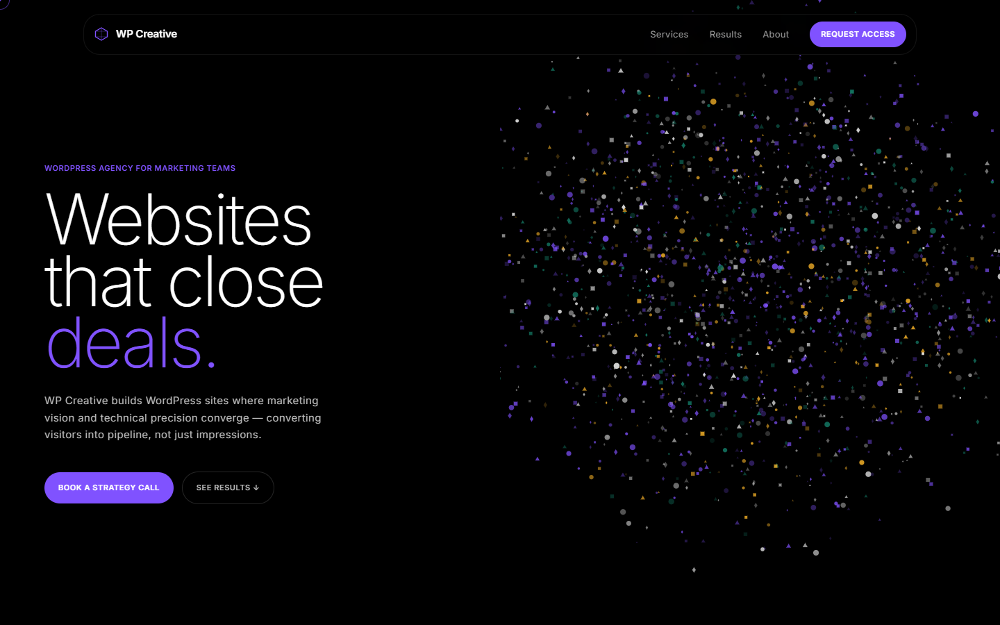

# WP Creative — Design Explorations

A set of fully interactive landing page prototypes for WP Creative, each built from a real design system reference sourced from [refero.design](https://styles.refero.design/). Coded, tested, and iterated with Claude. Versioned through Git.

---

## Live Designs

| Version | Design System | Theme | Preview |
|---|---|---|---|
| [v1](v1.html) | Aker-inspired | Dark cinematic gallery |  |
| [v2](v2.html) | Perplexity-inspired | Warm botanical parchment |  |
| [v3](v3.html) | OFF+BRAND | Iridescent sphere + parchment |  |
| [v4](v4.html) | Dala Design System | Deep navy void + particle constellation |  |

Open `index.html` to browse all four from a single showcase page.

---

## What's Inside

### Interactions (all versions)
- Water ripple effect on hero — physics-based dual-buffer simulation, colour-matched per design
- Custom cursor — lagged ring + dot
- Magnetic buttons — mouse-pull on CTAs
- Scroll reveal — IntersectionObserver with staggered children
- Counter animation — cubic ease on stat numbers
- Scroll progress bar
- Hero parallax

### v4 Specifics
- Particle constellation canvas — 1,800 micro-shapes (circles, triangles, diamonds, squares), polar clustering, mouse repel
- Liquid glass nav — solid on load, frosted glass on scroll (jitter-free wrapper approach)
- WordPress theme (`wpc-botanical`) — full Underscores-based build with ACF Pro local JSON sync

---

## WordPress Theme

`wpc-botanical` is a production-ready WordPress theme built from v2's design language.

**Requirements:** WordPress 6+, ACF Pro

**Setup:**
1. Install and activate ACF Pro
2. Upload `wpc-botanical.zip` via Appearance → Themes → Add New
3. Activate — ACF field groups auto-import from `acf-json/`
4. Set a page as Front Page under Settings → Reading

**Template parts:**
`hero` · `stats` · `features` · `results` · `services` · `diff` · `testimonials` · `clients` · `founders` · `process` · `cta`

All fields have hardcoded fallbacks — works without ACF data entered.

---

## Workflow

```
Refero design reference
        ↓
  Claude + brief
        ↓
  HTML/CSS/JS prototype
        ↓
  Local browser testing (Laragon / Live Server)
        ↓
  Git version control
```

Design references sourced from [refero.design](https://styles.refero.design/) — a library of real production design systems used as style tokens and layout inspiration.

---

## Design Tokens

| | v1 | v2 | v3 | v4 |
|---|---|---|---|---|
| **Background** | `#0a0a0a` | `#faf6ef` | `#faf6ef` | `#09102e` |
| **Accent** | `#b75928` | `#c85a1e` | `#c85a1e` | `#F7991C` |
| **Text** | `#e8e4df` | `#2c1f14` | `#2c1f14` | `#ffffff` |
| **Ripple** | teal · multiply | teal · multiply | teal · multiply | orange · screen |

---

## Stack

- Vanilla HTML / CSS / JS — no build tools, no dependencies
- ACF Pro (WordPress theme only)
- Headless Chrome for hero screenshots
- Git for version control

---

Built by [Nirmal Gyanwali](https://wpcreative.com.au) · WP Creative
